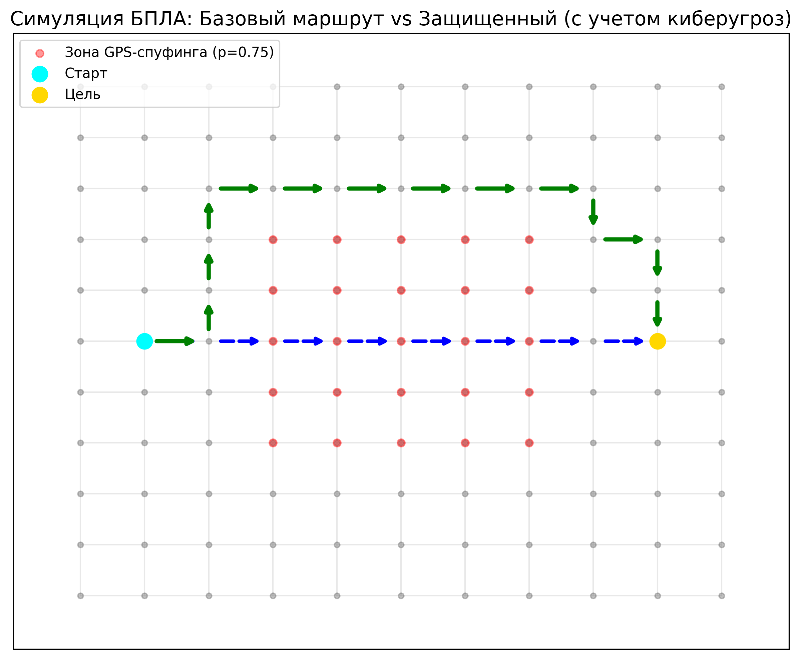

# Agro-UAV Route Planning Platform

Это масштабируемая многоуровневая серверная платформа для планирования маршрутов сельскохозяйственных БПЛА (Agro-UAV). 

## Архитектура проекта

Проект разбит на несколько микросервисов, которые взаимодействуют друг с другом:

- **API Gateway (`:8000`)**: Основная точка входа для клиентов (работает на FastAPI). Маршрутизирует запросы к соответствующим сервисам.
- **Route Planner (`:8001`)**: Микросервис для расчёта маршрутов БПЛА.
- **Threat Assessor (`:8002`)**: Микросервис для оценки возможных угроз на маршруте БПЛА.
- **Telemetry Processor (`:8003`)**: Микросервис для обработки данных телеметрии, поступающих с БПЛА.
- **Database (`:5432`)**: База данных PostgreSQL с расширением PostGIS для обработки геопространственных данных.

## Требования
- Docker 
- Docker Compose

## Запуск проекта

Для развертывания проекта локально используйте Docker Compose. Выполните команду в корневой директории проекта:

```bash
docker-compose up -d --build
```

Это соберет образы для каждого сервиса и запустит их в фоновом режиме.

После старта будут доступны следующие сервисы (включая автоматическую документацию Swagger):
- **API Gateway**: http://localhost:8000/docs
- **Route Planner**: http://localhost:8001/docs
- **Threat Assessor**: http://localhost:8002/docs
- **Telemetry Processor**: http://localhost:8003/docs

## Остановка проекта

Для остановки работы сервисов:

```bash
docker-compose down
```

Для удаления всех созданных volume (и, соответственно, удаления базы данных):

```bash
docker-compose down -v
```

## Тестирование и результаты симуляции

В ходе тестирования платформы на программном симуляторе сравнивались два режима планирования маршрута для агро-БПЛА: «Базовый» (без учета киберугроз) и «Защищённый» (с расчетом Q-критерия).

Рабочая сцена представляла собой граф из 120 узлов на сетке 200×200 м. Имитировалась инъекция GPS-спуфинг-атаки в один из секторов (p = 0,75).



**Таблица 1. Сравнение маршрутов «Базовый» vs «Защищённый»**

| Показатель | Базовый | Защищённый | Изменение |
| :--- | :--- | :--- | :--- |
| **Длина маршрута** (рёбер графа) | 74 | 83 | +12,2% |
| **Patt** (средняя вероятность атаки) | 0,58 | 0,14 | -75,9% |
| **Время перепланирования**, мс | — | 47 | — |
| **Число шагов симуляции** | 1 200 | 1 350 | +12,5% |

Как видно из результатов, применение модуля оценки киберугроз обеспечивает снижение вероятности успешной атаки на 75,9 % при увеличении длины маршрута на 12,2 % (в единицах рёбер графа). Время перепланирования составило 47 мс, что существенно ниже требований реального времени для типичных агро-БПЛА. Низкая латентность обусловлена работой алгоритма непосредственно на графовом представлении сцены без накладных расходов трёхмерного физического движка.